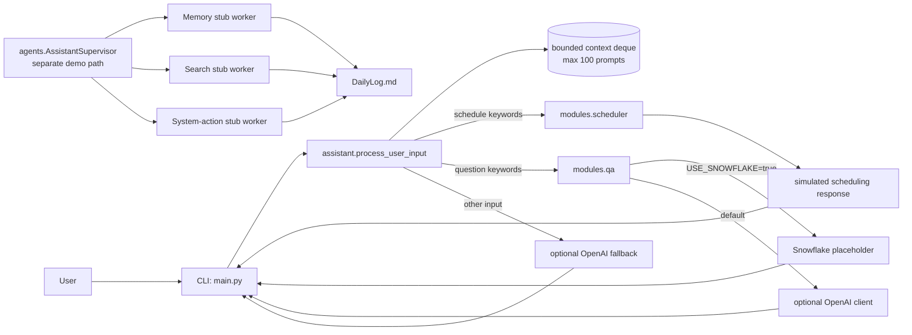
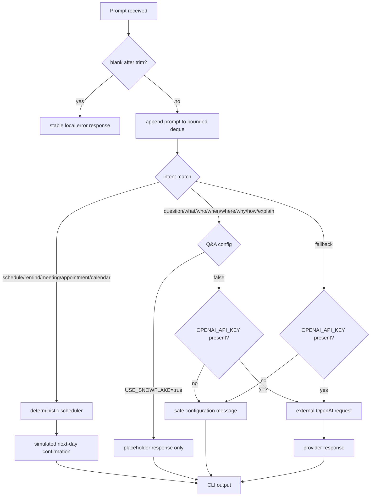

# AI-Powered Personal Assistant

[](https://github.com/CoreyLeath-code/AI-Powered-personal-Assistant/actions/workflows/ci-cd.yml)
[](https://github.com/CoreyLeath-code/AI-Powered-personal-Assistant/actions/workflows/ci.yml)
[](https://github.com/CoreyLeath-code/AI-Powered-personal-Assistant/actions/workflows/security.yml)
[](https://github.com/CoreyLeath-code/AI-Powered-personal-Assistant/actions/workflows/codeql.yml)
[](https://github.com/CoreyLeath-code/AI-Powered-personal-Assistant/actions/workflows/benchmarks.yml)
[](https://github.com/CoreyLeath-code/AI-Powered-personal-Assistant/actions/workflows/release.yml)
[](LICENSE)

A lightweight personal-assistant systems prototype focused on deterministic intent routing, testable scheduling and question-answering boundaries, bounded in-process context, optional provider-backed Q&A, reproducible microbenchmarks, and release automation. The repository is intentionally explicit about which paths are real integrations and which are demonstrations or stubs.

> **Scope:** this is a portfolio engineering system, not a production-authorized personal-data service. The default runtime is local and deterministic unless optional credentials/configuration enable an external provider.

## What is actually implemented

- A CLI entry point in `main.py` that delegates user prompts to `assistant.main.process_user_input`.
- Keyword-based routing for scheduling, Q&A, and fallback behavior.
- A bounded in-memory deque retaining at most the latest 100 prompts.
- A deterministic scheduling module that returns simulated confirmations; it does **not** create real calendar events.
- A Q&A module with an optional OpenAI call and a Snowflake **placeholder** path.
- A separate supervisor demonstration with memory/search/system-action **stub workers** and append-only `DailyLog.md` output.
- Python 3.10/3.11/3.12 CI, Ruff/compile validation, security scanning, CodeQL, scheduled benchmarks, Docker packaging, and semantic-tag release automation.

The supervisor demo is not wired into the interactive assistant router. Treat it as an experimental orchestration surface rather than a claim of live vector search, web search, or system automation.

## Architecture flowchart



## System design flowchart



The provider call is the principal external trust boundary in the interactive path. The current code does not yet define explicit client timeout, retry/backoff, circuit-breaker, rate-limit, structured redaction, or provider-response validation policies; those remain production-hardening work.

## Quickstart

### Local development

Prerequisites: Python 3.10+ and Git.

```bash
git clone https://github.com/CoreyLeath-code/AI-Powered-personal-Assistant.git
cd AI-Powered-personal-Assistant

python -m venv .venv
# Linux/macOS
source .venv/bin/activate
# Windows PowerShell: .venv\Scripts\Activate.ps1

python -m pip install --upgrade pip
python -m pip install -r requirements.txt -r requirements-dev.txt

pytest --cov=assistant --cov=modules --cov=agents --cov=scripts --cov-report=term-missing
ruff check .
python -m compileall -q assistant modules agents scripts src
python main.py
```

Without `OPENAI_API_KEY`, provider-backed routes return a safe configuration message instead of making a network call.

### Docker

```bash
docker build -t ai-powered-personal-assistant .
docker run -it ai-powered-personal-assistant
```

For provider-backed behavior, pass environment variables at runtime rather than committing secrets.

## Configuration boundaries

The default path should be usable without live external services. Relevant optional configuration includes:

```text
OPENAI_API_KEY=...
LANGUAGE_MODEL=...
USE_SNOWFLAKE=false
```

`USE_SNOWFLAKE=true` currently selects a placeholder function; it does not establish a real Snowflake connection. Similarly, `agents/supervisor.py` returns deterministic stub outputs for its worker demonstrations.

## Reproducibility contract

For a clean-checkout verification run:

```bash
make install
make lint
make test
make benchmark
make docker-build
```

Equivalent explicit benchmark command:

```bash
python benchmarks/assistant_benchmarks.py --iterations 500 --output benchmark-results.json
python -m json.tool benchmark-results.json
```

For a result to be treated as comparable research evidence, record at minimum the commit SHA, Python version, host/runner class, iteration count, benchmark harness version, and whether external services were disabled. The committed `benchmark-results.json` records generation time, 500 iterations, and harness path; it does not by itself establish cross-hardware comparability.

## Research-style benchmark evidence

Committed benchmark artifact: `benchmark-results.json`, generated 2026-07-12 with 500 iterations per measured route.

| Component benchmark | Mean | Median | P95 | Scope |
|---|---:|---:|---:|---|
| Intent router — Q&A route | 0.001144 ms | 0.0011 ms | 0.0012 ms | local keyword routing only |
| Intent router — schedule route | 0.003916 ms | 0.0030 ms | 0.0060 ms | local routing + deterministic scheduler path |
| Intent router — fallback route | 0.000982 ms | 0.0010 ms | 0.0010 ms | local routing before optional provider execution |
| Supervisor — memory route | 0.291320 ms | 0.25865 ms | 0.4074 ms | stub worker + local log path |
| Supervisor — search route | 0.266136 ms | 0.2445 ms | 0.3564 ms | stub worker + local log path |

These are microbenchmarks of deterministic local code. They do **not** measure OpenAI latency, Snowflake latency, real web search, calendar APIs, concurrency, container startup, end-to-end user latency, throughput, cost, or semantic answer quality. No throughput value is inferred from these latencies because the harness does not measure a sustained service workload.

### Benchmark interpretation

The local keyword router is computationally trivial, so sub-millisecond values are expected and are useful mainly for regression detection. The supervisor numbers are also not evidence of retrieval/search performance because its worker methods return fixed demonstration strings. A stronger next experiment is a versioned evaluation matrix separating routing correctness, tool selection, external-provider latency, failure behavior, and semantic quality.

## Verification and CI

The repository currently separates concerns across workflows:

- `ci-cd.yml`: Python 3.10, 3.11, and 3.12 tests with coverage.
- `ci.yml`: Ruff and compile validation.
- `benchmarks.yml`: deterministic benchmark generation, JSON validation, and artifact upload.
- `security.yml`: verified-secret scanning plus Python dependency audit.
- `codeql.yml` / `sast.yml`: static security analysis.
- `release.yml`: tag-triggered GitHub Release artifacts and GHCR image publication.

A green badge means the configured workflow passed for its referenced branch/run; it does not independently prove production readiness.

## Release contract

Tags matching `v*.*.*` trigger the release workflow. The workflow publishes:

1. a GitHub Release with generated release notes;
2. a source archive named `ai-powered-personal-assistant-<tag>.tar.gz`;
3. a SHA-256 checksum file for that archive;
4. a GHCR container image at `ghcr.io/coreyleath-code/ai-powered-personal-assistant`, tagged with the release tag and `latest`.

Before tagging a release, require green CI, quality, security, CodeQL, and benchmark workflows for the release commit.

## L6 engineering assessment

Strengths already demonstrated:

- Small deterministic core with optional network dependencies kept out of routine CI.
- Bounded prompt retention rather than unbounded process memory growth.
- Multi-version Python verification and separate quality/security workflows.
- Machine-readable benchmark output rather than README-only performance claims.
- Containerized execution and semantic-tag release automation.
- Explicit separation of measured evidence from aspirational production controls.

Highest-priority gaps before a production-readiness claim:

1. **Provider resilience:** define timeout, retry/backoff, cancellation, rate-limit, and circuit-breaker behavior for external LLM calls.
2. **Tool reality vs. stubs:** replace or clearly isolate the Snowflake, memory, search, and system-action demonstrations with contract-tested adapters before claiming live integrations.
3. **Scheduling semantics:** persist an explicit structured schedule object and connect to a real calendar only behind an authenticated/idempotent tool boundary.
4. **Evaluation depth:** add versioned adversarial/ambiguous intent fixtures, tool-selection accuracy, provider-failure cases, and semantic-quality evaluation.
5. **Privacy/security:** define data classification, redaction, retention, secret management, and audit behavior before handling sensitive personal prompts.
6. **Observability:** add structured request/tool metrics, trace/correlation IDs, error taxonomy, and cost/token telemetry without logging sensitive prompt bodies.
7. **Release provenance:** the release now adds source checksums and GHCR packaging; future work can add SBOM attachment, image digests, and attestations/signing.

See `L6_AUDIT.md` for the detailed review.

## Q&A

**Is this a fully autonomous agent?**  
No. The main runtime is a deterministic router with scheduling/Q&A branches and an optional LLM call. `AssistantSupervisor` demonstrates orchestration concepts separately, but its workers are currently stubs.

**Does it really schedule meetings or reminders?**  
No. The scheduler returns deterministic simulated confirmations. It does not write to Google Calendar, Outlook, a database, or an operating-system scheduler.

**Does it use Snowflake?**  
The Q&A module exposes a configuration branch named for Snowflake, but the implementation currently returns a placeholder string rather than executing a Snowflake query.

**Does it perform live web search or vector retrieval?**  
Not in the current supervisor implementation. Those worker methods are deterministic demonstrations and should not be presented as live integrations.

**What happens without an OpenAI key?**  
The assistant returns a safe message explaining that `OPENAI_API_KEY` is not configured; tests and benchmarks therefore do not require live provider access.

**Why benchmark a keyword router?**  
The microbenchmark is useful as a regression signal and reproducibility exercise. It is not a capacity benchmark or evidence of end-to-end assistant quality.

**What would make this stronger for a senior engineering interview?**  
Contract-tested real tool adapters, explicit provider resilience policies, structured durable task state, adversarial evaluation fixtures, privacy-aware observability, and end-to-end concurrency/failure benchmarks would materially raise the engineering depth.

## Repository layout

```text
assistant/                 interactive routing core
modules/                   scheduler and Q&A modules
agents/                    separate supervisor/stub-worker demonstration
benchmarks/                deterministic benchmark harness
logs/                      recorded sample evidence
scripts/                   utility/automation scripts
src/                       additional project components
dashboard/                 optional dashboard-related code
.github/workflows/         CI, quality, security, benchmark, and release automation
Dockerfile                 core runtime container
Makefile                   local verification shortcuts
benchmark-results.json     committed benchmark evidence
L6_AUDIT.md                senior-engineering audit
CHANGELOG.md               release history
```

## License

MIT. See [LICENSE](LICENSE).
