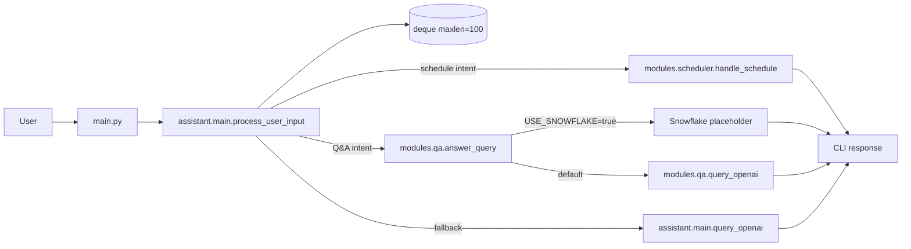
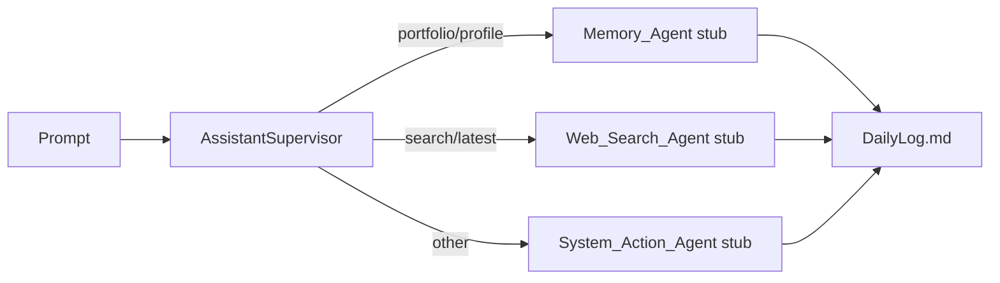
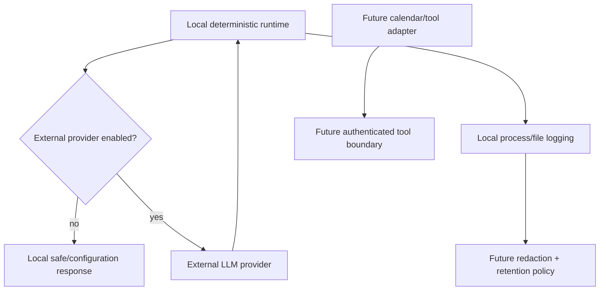

# AI-Powered Personal Assistant Architecture

This document separates the executable interactive runtime from the separate supervisor demonstration so the repository does not imply integrations that are not wired into the main application.

## Interactive runtime

### Runtime boundaries

- `main.py` is the interactive CLI entry point.
- `assistant/main.py` owns the keyword router and bounded prompt deque.
- `modules/scheduler.py` returns simulated scheduling confirmations; it has no durable task/calendar side effect.
- `modules/qa.py` optionally calls OpenAI. Its Snowflake branch is a placeholder.
- External provider calls are optional and are not exercised by default tests/benchmarks.

## Separate supervisor demonstration

The worker methods currently return fixed demonstration strings. They do not perform live vector retrieval, web search, or system actions. `AssistantSupervisor` is not called by the interactive CLI router.

## Trust boundaries

Before handling sensitive personal data or executing consequential tools, add explicit authentication, authorization, idempotency, redaction, retention, timeout/cancellation, error normalization, and audit controls.
